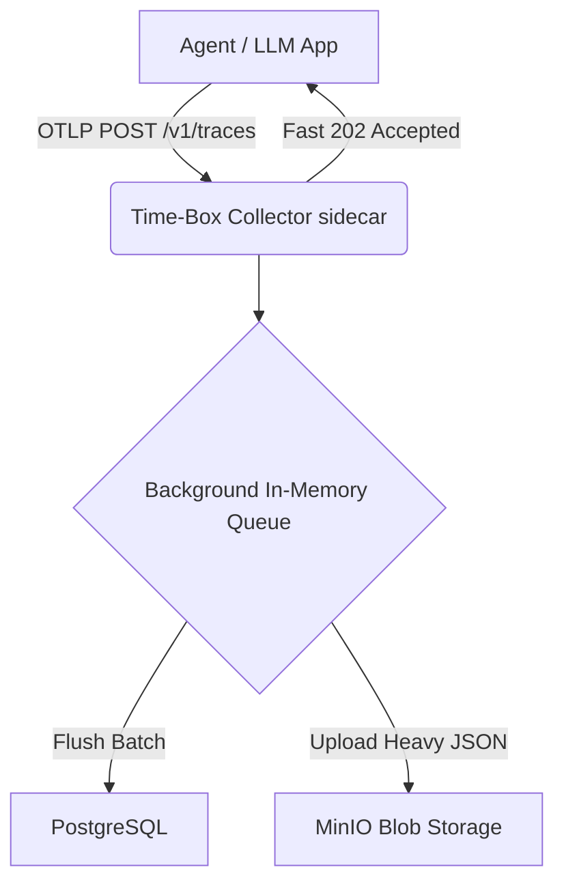

<div align="center">
  
  <h1>⏱️ time-box</h1>
  <p><strong>The Agentic Black Box Recorder</strong></p>
  <p><em>Lightning-fast, strictly non-blocking AI observability layer. Record every prompt, token, and state transition without degrading agent performance.</em></p>

  [](https://opensource.org/licenses/MIT)
  [](https://www.typescriptlang.org/)
  [](https://opentelemetry.io/)
</div>

---

## 🌪️ The Philosophy (The Golden Rule)

> **"The execution layer must never wait for the observability layer."**

`time-box` is built around strict event-sourcing and out-of-band telemetry. 
LLMs and Agentic workflows are computationally expensive and latency-sensitive. Traditional observability tools often block the main thread waiting for heavy database inserts. 

**`time-box` changes this.** Using standard W3C Context Propagation and OpenTelemetry protocols (OTLP), `time-box` instantly accepts traces (`202 Accepted`) and processes the massive unstructured context payloads in a background queue, routing lightweight metadata to **PostgreSQL** and heavy LLM contexts to **MinIO (S3)**.

## 🚀 Features

- **Blazing Fast Ingestion:** Next-gen Node/Bun HTTP sidecar that responds in `< 2ms`.
- **Dual-Storage Engine:** Protects your relational database from massive context window bloat by splitting structured and unstructured payloads.
- **Privacy by Default:** Raw payloads are redacted unless explicitly opted into via `OTEL_INSTRUMENTATION_GENAI_CAPTURE_MESSAGE_CONTENT=true`.
- **Framework Agnostic:** Fully compatible with standard OpenTelemetry Exporters (LangGraph, AutoGen, LlamaIndex, etc.).
- **Built-in Backpressure:** Uses an in-memory batching queue to absorb massive traffic spikes seamlessly.
- **W3C Distributed Tracing:** Reconstruct perfect timelines of your agent's execution across infinite microservices.

## 🏗️ Architecture



## 📦 Getting Started

### 1. Stand up the Infrastructure
We use Docker to run PostgreSQL and MinIO natively.
```bash
git clone https://github.com/0xadityaa/time-box.git
cd time-box
docker-compose up -d
```

### 2. Start the Collector
Ensure you have `bun` installed.
```bash
cd apps/collector
bun install
bun run src/index.ts
```

### 3. Instrument your Agent
Install the lightweight SDK in your AI application:
```bash
npm install @time-box/core
```

Initialize it at the top of your execution script:
```typescript
import { initTimeBox, trace } from '@time-box/core';

initTimeBox({
  serviceName: 'my-agent-system',
  apiKey: 'mysecret',
});

// Wrap your LLM calls
await trace('chat_completion', { 'gen_ai.system': 'openai' }, async (span) => {
  const result = await myLlmCall();
  span.setAttribute('gen_ai.usage.input_tokens', result.inputTokens);
  return result;
});
```

*(Note: If you are using standard frameworks like LangGraph, you don't even need our SDK! Just point your standard OpenTelemetry Exporter to `http://localhost:4318/v1/traces`)*

## 🛠️ Tech Stack
- **Collector:** Bun, Hono, OpenTelemetry SDK, Prisma
- **Storage:** PostgreSQL (Metadata), MinIO (S3 Heavy Blobs)
- **Dashboard:** Next.js, Tailwind, Shadcn UI *(Coming soon in Phase 4!)*
- **SDK:** TypeScript, tsup (CJS/ESM)

## 🤝 Contributing
We use Trunk-based development. Please check out a `feat/*` branch from `dev` and submit a Pull Request.

---
*Built for the next generation of autonomous systems.*
