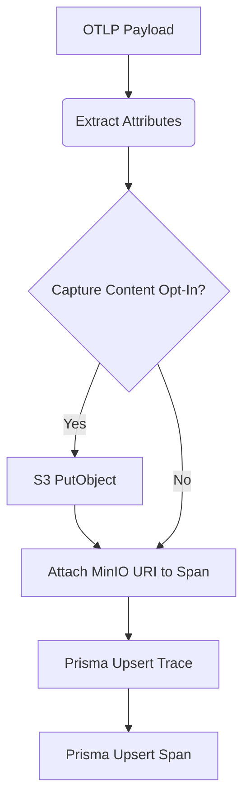

# High-Level Design (HDL): Collector Processor

## Purpose
The Collector Processor is responsible for receiving W3C OpenTelemetry Protocol (OTLP) JSON payloads, mapping them into the Time-Box relational schema, and executing durable storage operations.

## Architecture Decisions
- **Out-of-band Processing**: The processor executes completely asynchronously from the HTTP request thread. This guarantees O(1) response times for the client agent.
- **Dual Storage Strategy**: 
  - *PostgreSQL*: Stores highly structured metadata (`latencyMs`, `tokens`, `genAiSystem`).
  - *MinIO / S3*: Stores the massive unstructured JSON blob payloads representing the prompt/context windows. This prevents the relational database from suffering extreme page bloat.
- **Composite Primary Keys**: Due to OTLP span IDs only being unique within a specific trace, we use `${traceId}:${spanId}` as the globally unique primary key in Postgres.

## Flow Diagram

