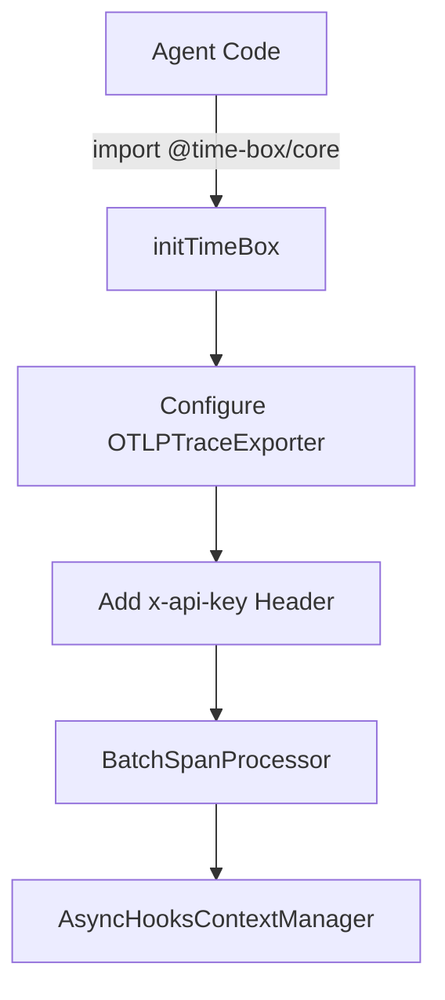

# High-Level Design (HDL): time-box/core SDK

## Purpose
The `@time-box/core` SDK is a lightweight Node/Bun client that standardizes the initialization of the OpenTelemetry pipeline and automatically propagates context across microservices.

## Architecture Decisions
- **Standard Over Custom**: Rather than building a proprietary tracing client, the SDK configures the standard OpenTelemetry Node SDK (`@opentelemetry/sdk-trace-base`). This makes it fully compliant with OTLP standard, ensuring `time-box` doesn't enforce vendor lock-in.
- **Batch Exporting**: We utilize `BatchSpanProcessor` natively instead of `SimpleSpanProcessor`. This sends span metrics in background batches every 1000ms, ensuring that LLM/agent code never waits for telemetry to dispatch over HTTP.
- **W3C Standard Propagation**: The SDK injects `W3CTraceContextPropagator` globally so that `traceparent` headers are correctly extracted/injected on any HTTP calls traversing different services.

## Flow Diagram

