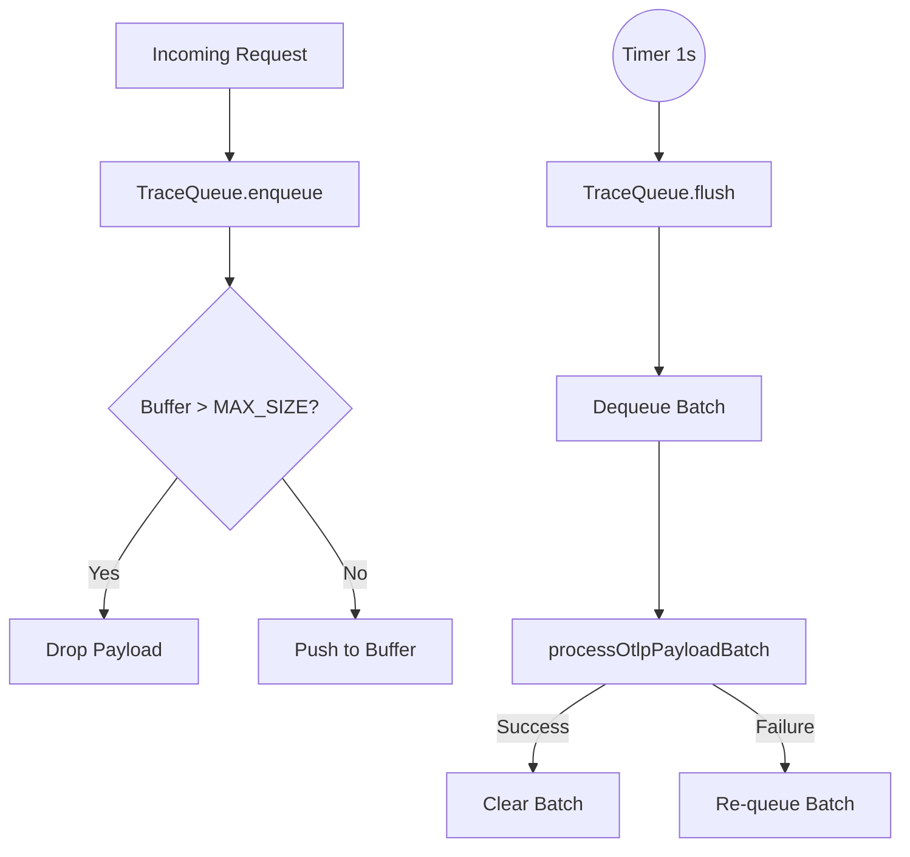

# High-Level Design (HDL): Trace Queue

## Purpose
The Trace Queue buffers high-frequency telemetry data in-memory before bulk-inserting it into the storage layer. This architecture provides backpressure and decoupling.

## Architecture Decisions
- **In-Memory Buffering**: Because traces are emitted asynchronously by agent systems, database spikes could bottleneck ingestion. Buffering handles traffic surges.
- **Backpressure Mechanism**: If the queue exceeds `MAX_SIZE` (e.g., 50,000), it drops new payloads. This prevents the Collector from suffering an Out-of-Memory (OOM) crash under severe load.
- **Fail-Safe Flushing**: The queue flushes every `1000ms`. If the `processOtlpPayloadBatch` fails (e.g., database outage), the batch is requeued at the head of the buffer so data is not permanently lost.

## Flow Diagram

