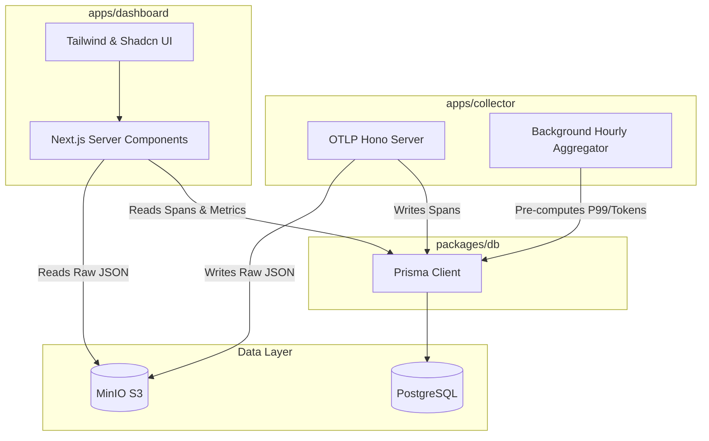

# Phase 3 Run Document: Dashboard & Shared Database

## Architecture Update

## Changes Implemented

1. **Shared `@time-box/db` Workspace**: Extracted Prisma out of the collector into a shared library. This ensures strong typing across both applications and allows Next.js to leverage server components to securely query Postgres.
2. **Background Metrics Aggregation**: The collector now runs an hourly interval job (`aggregator.ts`) to calculate P50/P90/P99 latency percentiles and system token usage, storing them in a new `HourlyMetrics` table. This prevents heavy aggregate queries from crippling the DB.
3. **Next.js Dashboard Scaffolding**: 
    - Initialized Next.js 16.2.6 app router, Shadcn UI, and Tailwind.
    - Implemented global Dark Mode/Glassmorphism layouts.
    - Added `/` (Overview) for system metrics.
    - Added `/traces` and `/traces/[id]` for debugging.
4. **MinIO Payload Viewer**: Integrated `react-syntax-highlighter` to pull `payloadUri` blobs straight from MinIO and render them securely for GenAI prompts.
