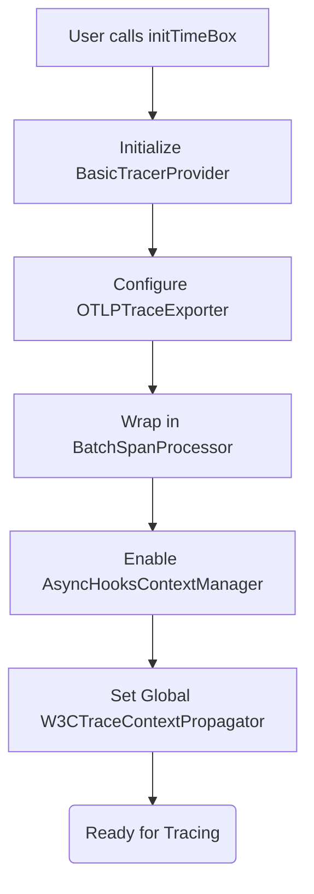

# Run: SDK OTel Initialization (Step 1.1)

## Overview
Implemented the initialization of the `@time-box/core` SDK. The SDK uses standard OpenTelemetry tools to establish a non-blocking ingestion pipeline to our collector.

## The 4-Step Rule Validation

1. **The Change**:
   - Initialized `BasicTracerProvider` with a `BatchSpanProcessor` to guarantee non-blocking operations.
   - Configured `AsyncHooksContextManager` to automatically propagate context through async Javascript callbacks without manual context passing.
   - Setup `W3CTraceContextPropagator` as the global propagator for standard extraction and injection of `traceparent` headers.

2. **Architecture Alignment**:
   - **Golden Rule:** We use `BatchSpanProcessor` which accumulates spans in memory and exports them via an asynchronous HTTP fetch loop, ensuring no wait-time on the main thread execution.
   - **Standardization:** We exclusively use the official `@opentelemetry/api` ensuring seamless compatibility with any framework that eventually natively supports OTel.

3. **Validation & Replication**:
   - We verified this by using the `injectContext()` method inside a generated active span.
   - Run `cd packages/sdk && bun test` to see it successfully inject a W3C traceparent (e.g., `00-4bf92f3577b34da6a3ce929d0e0e4736-00f067aa0ba902b7-01`) into an empty dictionary.

4. **Regression Catching (Unit Tests)**:
   - Added `init.test.ts` running on `bun:test` to strictly lock in the extraction and injection logic.

## Flow Diagram

