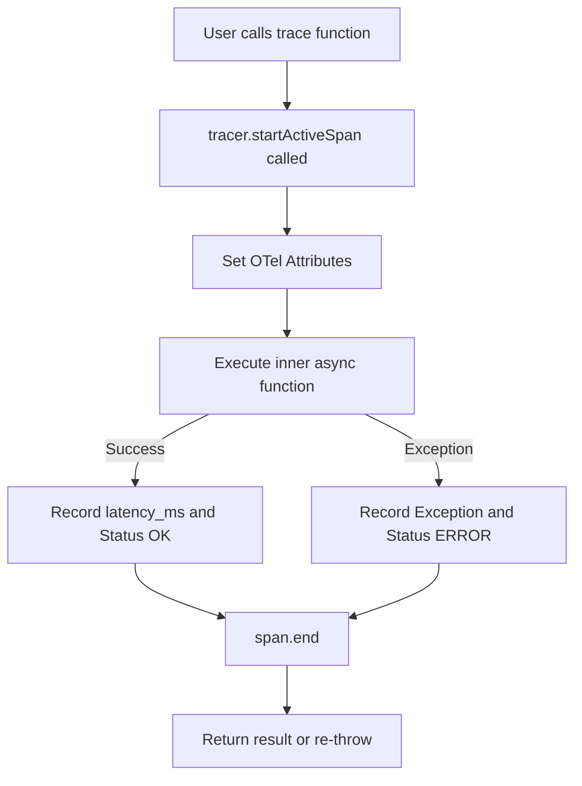

# Run: SDK Functional Trace Wrapper (Step 1.2)

## Overview
Implemented the functional wrapper `trace<T>(name, attributes, fn)` in the `@time-box/core` SDK. This allows users to easily wrap any asynchronous function to automatically generate Spans without writing verbose OTel boilerplate.

## The 4-Step Rule Validation

1. **The Change**:
   - Wrote `packages/sdk/src/tracer.ts` exporting the `trace` function.
   - It leverages `tracer.startActiveSpan` to immediately set the context for the duration of the execution.
   - It captures start/end execution times natively using `performance.now()`, catching errors and assigning appropriate OpenTelemetry Span Status Codes (`OK` or `ERROR`).

2. **Architecture Alignment**:
   - **Idiomatic JS/TS**: Instead of forcing classes or decorators, the functional API fits naturally into modern TypeScript codebases (like Next.js or raw Bun scripts).
   - **Semantic Conventions**: Attributes passed directly via `TraceAttributes` map to standard `gen_ai.*` fields to ensure compatibility with our Collector's parsing logic.

3. **Validation & Replication**:
   - Verified that executing a wrapped function correctly returns the inner value without blocking or mangling the promise.
   - Run `cd packages/sdk && bun test src/tracer.test.ts`.

4. **Regression Catching (Unit Tests)**:
   - Added `tracer.test.ts`. Verified that successful executions return values and failed executions properly catch errors, record exceptions on the Span, and re-throw to the caller.

## Flow Diagram

