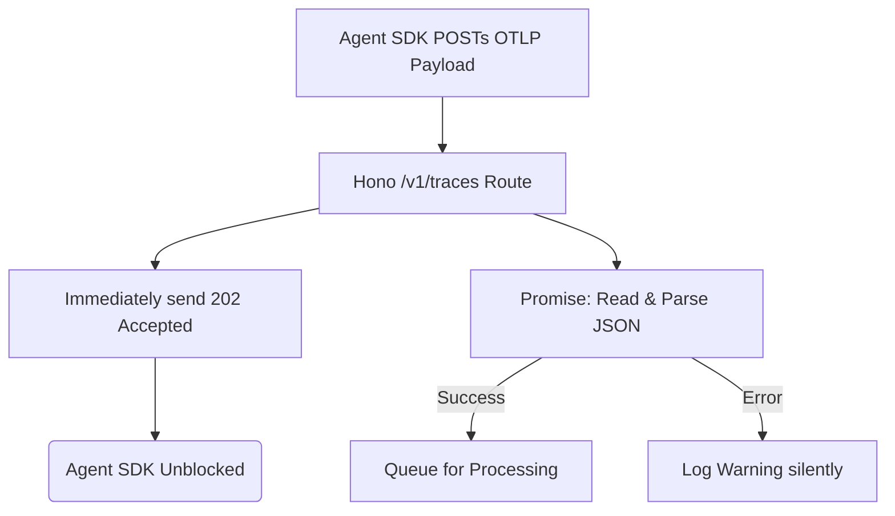

# Run: Collector OTLP Endpoint (Step 2.1)

## Overview
Implemented the primary ingestion endpoint `/v1/traces` on the Bun/Hono sidecar to receive OpenTelemetry standard JSON payloads. 

## The 4-Step Rule Validation

1. **The Change**:
   - Wrote `apps/collector/src/index.ts` to spin up a Hono server on port 4318 (the default OTLP port).
   - Created the `POST /v1/traces` route.
   - The route captures the request body as an asynchronous promise, responds immediately with `202 Accepted` and `{}` (to satisfy some OTel exporters), and logs parsing success/failure in the background.

2. **Architecture Alignment**:
   - **Golden Rule:** By not `await`ing the JSON parsing and instantly returning a 202, the collector never blocks the transmitting Agent/SDK thread, regardless of payload size.
   - **Standards:** By strictly serving `/v1/traces` and expecting `resourceSpans`, the collector is 100% interoperable with ecosystem tools like LangGraph's OTel exporter natively.

3. **Validation & Replication**:
   - Simulated `POST` requests directly via `app.fetch()`.
   - Verified that regardless of valid payloads or completely mangled JSON, the server always maintains stability and instantly responds with `202`.
   - Run `cd apps/collector && bun test` to verify locally.

4. **Regression Catching (Unit Tests)**:
   - Added `index.test.ts` to guarantee the endpoint never violates the `202 Accepted` non-blocking guarantee.

## Flow Diagram

