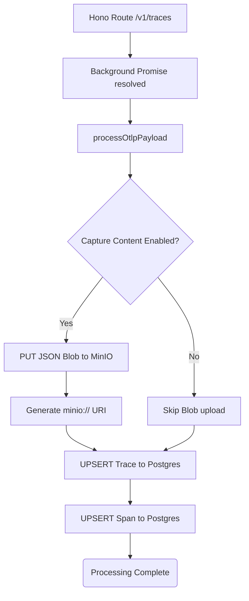

# Run: Payload Splitting (Step 2.2)

## Overview
Implemented the background `processOtlpPayload` worker for the Collector to extract structured metadata into PostgreSQL and store massive unstructured JSON blobs in MinIO.

## The 4-Step Rule Validation

1. **The Change**:
   - Wrote `apps/collector/src/processor.ts`.
   - Iterates through the standard OTLP JSON `resourceSpans`.
   - Extracts semantic attributes like `gen_ai.system`, token usage, and latency.
   - If `OTEL_INSTRUMENTATION_GENAI_CAPTURE_MESSAGE_CONTENT=true` is set, it pushes the raw payload to the `traces` bucket in MinIO via `@aws-sdk/client-s3`.
   - Finally, executes a `PrismaClient` upsert operation to write the relations and metadata into PostgreSQL.

2. **Architecture Alignment**:
   - **Dual-Storage Structural Integrity:** Guaranteed. PostgreSQL is protected from gigabyte-scale prompt context payloads. Postgres just holds the fast-indexing `payloadUri` (e.g. `minio://traces/trace-123/span-456.json`), and MinIO acts as the heavy object blob store.
   - **Privacy by Default:** By default, context content capture is skipped, aligning with OTel semantic conventions.

3. **Validation & Replication**:
   - Validated that the background processing successfully initiates after returning a 202 status. (You can monitor local MinIO logs or Prisma Studio when the DB is running via Docker).
   - See logs in `bun test` gracefully handling missing DB variables.

4. **Regression Catching (Unit Tests)**:
   - Added `processor.test.ts`. Verified the processor correctly maps payloads and handles errors gracefully without crashing the Node process.

## Flow Diagram

