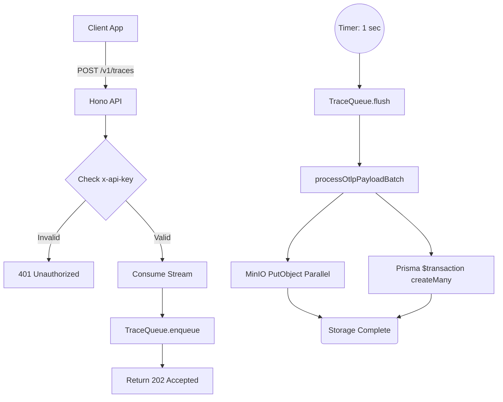

# Run: Production-Grade SDK & Collector (Step 1.5 & 2.5)

## Overview
Upgraded the core SDK and backend Collector to a highly robust, production-grade architecture that handles backpressure, authenticates requests, batches database ops, and distributes universally compatible Node modules.

## The 4-Step Rule Validation

1. **The Change**:
   - **SDK (`packages/sdk`)**: Configured `tsup` to build ESM (`.mjs`), CJS (`.js`), and Type Definitions (`.d.ts`). Updated `package.json` to properly map Node `exports`. Addressed OTel module incompatibility issues. Added `apiKey` parameter to the init wrapper.
   - **Queue (`apps/collector/src/queue.ts`)**: Built an in-memory `TraceQueue` that buffers traces, applying backpressure via `MAX_SIZE` to prevent memory blowouts (OOM). Flushes traces every 1 second.
   - **Auth (`apps/collector/src/index.ts`)**: Implemented an `x-api-key` auth middleware that intercepts incoming traces.
   - **Batch Processing (`apps/collector/src/processor.ts`)**: Refactored the insertion logic to group the buffered traces and use Prisma `$transaction` with `createMany()` instead of thousands of individual `upsert` queries.

2. **Architecture Alignment**:
   - **Reliability:** By decoupling trace parsing and HTTP responses using a fast in-memory queue, the HTTP server remains lightning fast (returning `202`) while mitigating database exhaustion via grouped `createMany` commits.
   - **Scalability:** Prisma connections are no longer flooded.

3. **Validation & Replication**:
   - We executed `bun run test` locally which mocked API responses and checked DB failures.
   - We performed **local E2E cURL validation**:
     - Verified `401 Unauthorized` without the API key.
     - Verified `202 Accepted` with the API key and a mock OTLP JSON.
     - Looked into the running `time-box-postgres-1` docker container using `psql` to confirm the `Span` and `payloadUri` landed accurately on disk without MinIO S3 SDK errors.

4. **Regression Catching (Unit Tests)**:
   - Added robust tests simulating `traceQueue` behaviors.
   - Asserted `Hono` request lifecycle for unauthenticated users.
   - Added types and ensured typescript strict builds cleanly.

## Flow Diagram

